## Лабораторная работа 1

### Топология сети
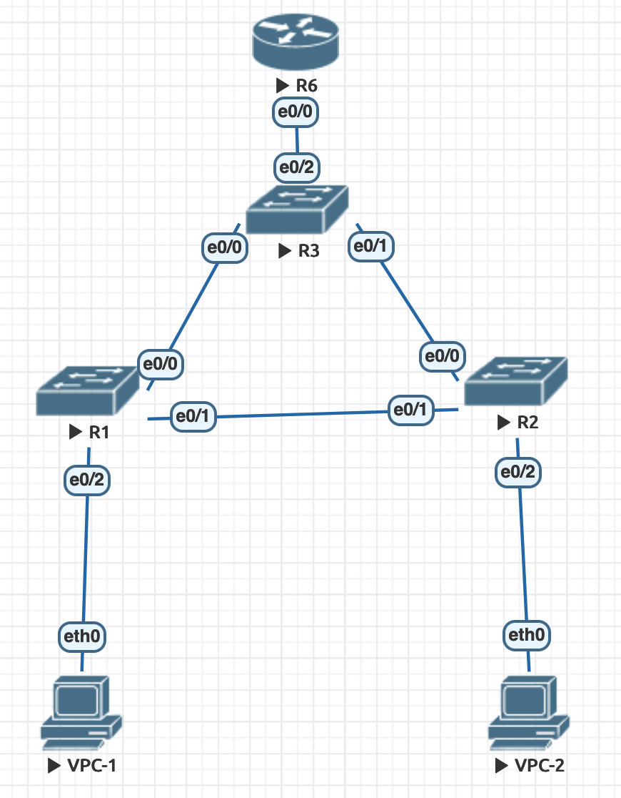

### VPC могут посылать друг другу ping
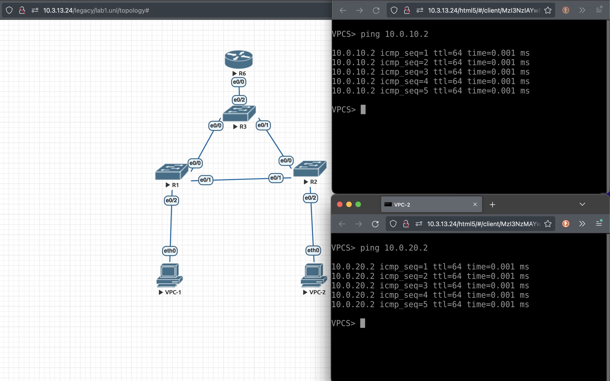

### Настроены vlan 10 и vlan 20
* VPC-1 находится во vlan10, его ip адрес 10.0.10.2 с маской 255.255.255.0
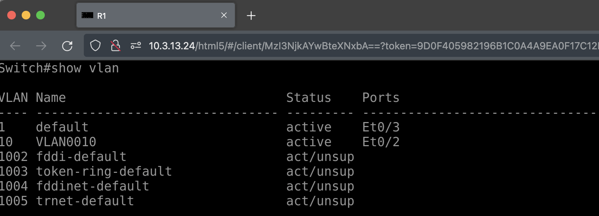
* VPC-2 находится во vlan20, его ip адрес 10.0.20.2 с маской 255.255.255.0
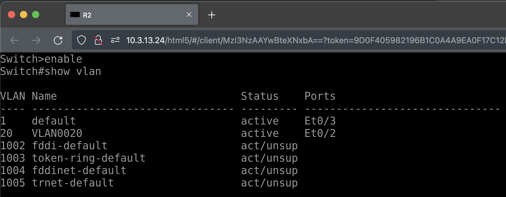
* У коммутаторов R1, R2, R3 настроены trunk порты
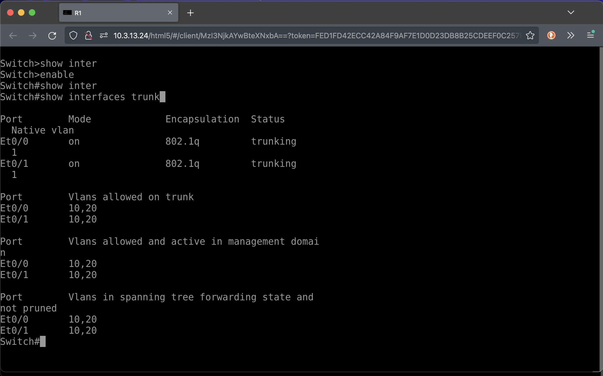
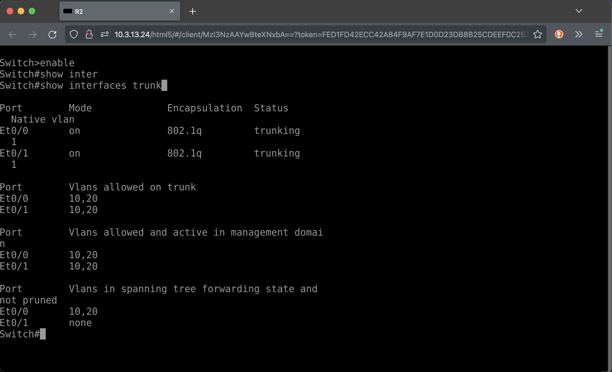
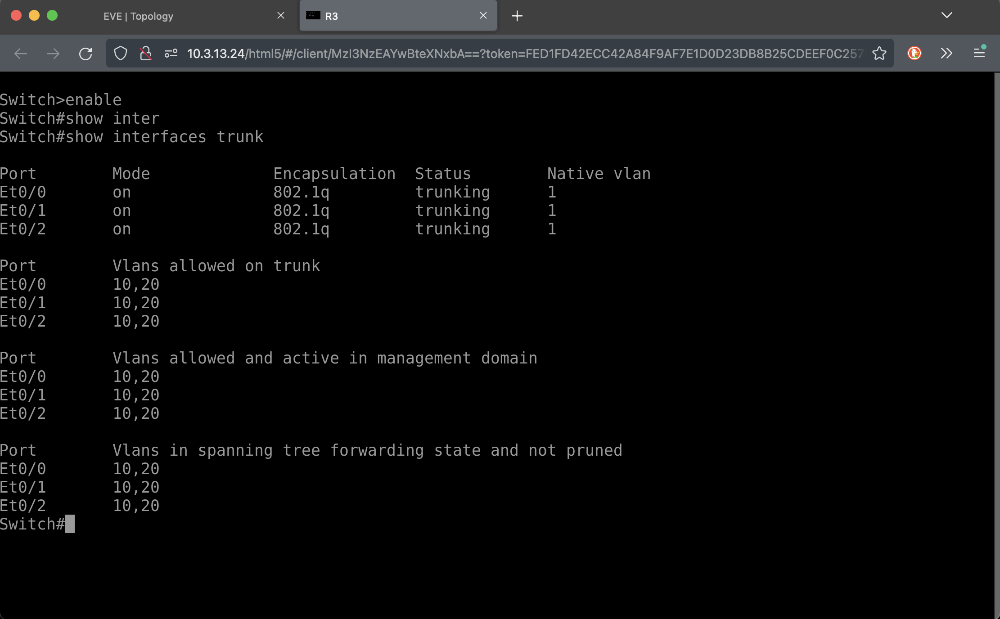

### Настроен STP
* Коммутатор R3 является корнем vlan 10 и vlan 20
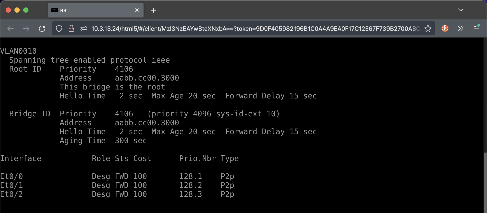
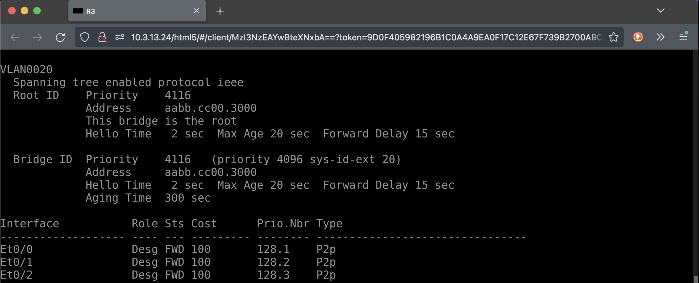
* Между коммутаторами R1 и R2 заблокирован линк (в обоих vlan)
  - vlan 10
  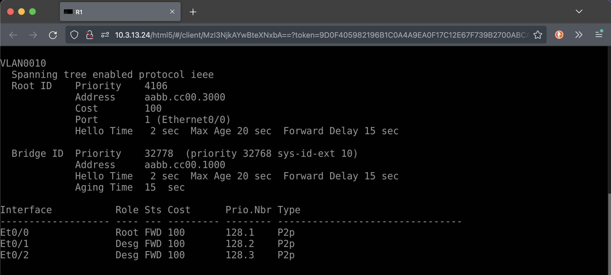
  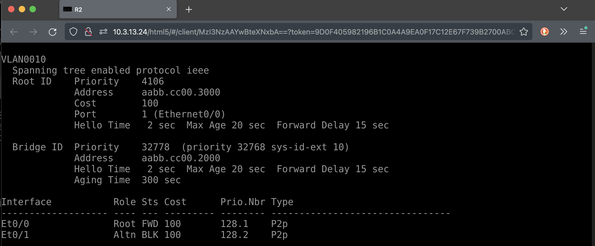
  - vlan 20
  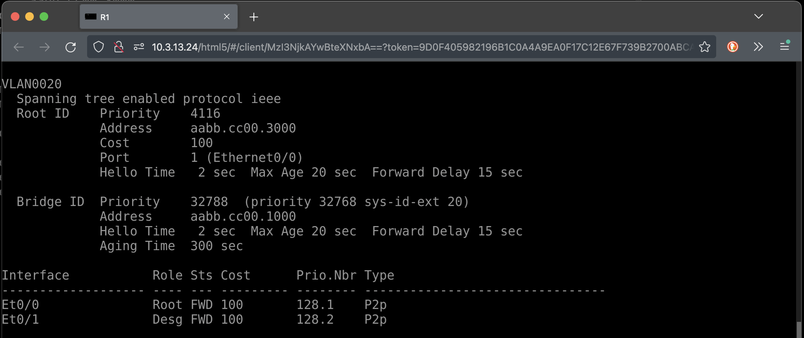
  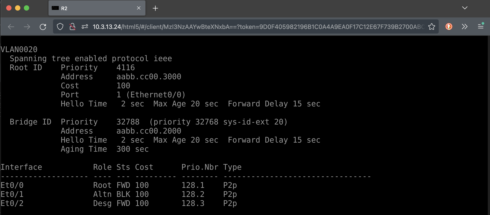

### На роутере R6 настроено два виртуальных порта
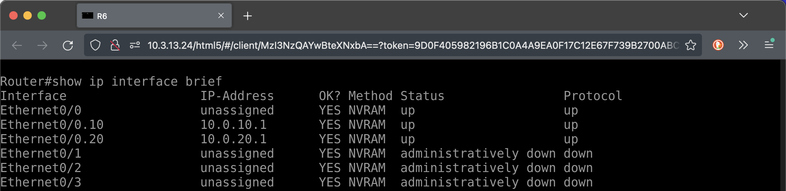