## Лабораторная работа 3
Сеть имеет следующую топологию:
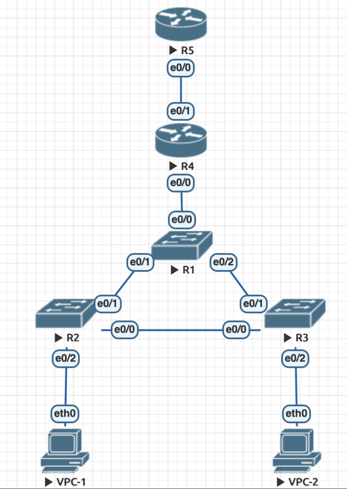
VPC-1 находится по vlan10, VPC-2 во vlan20. Vlan10 соответствует подсети 192.168.2.0/24, Vlan20 192.168.3.0/24.

Порты, соединяющие коммутаторы друг с другом настроены как trunk, а соединяющие с VPC -- как access.

На маршрутизаторе R4 настроен DHCP через два виртуальных порта e0/0.10, e0/0.20 для vlan 10 и vlan 20, соответсвенно. Из раздачи для каждого vlan-а исключены первые 10 ip адресов из соответсвующей ему подсети.

Маршрутизатор R5 эмулирует сеть интернет, у его порта e0/0 настроен IP адрес из белого диапозона адресов 94.100.180.1 c маской 255.255.255.224. Соответсвенно, на порте e0/1 маршрутизатора R4 установлен адрес 94.100.180.2 с той же маской.

На маршрутизаторе R4 также настрое NAT (точнее, PAT), разрешающий пробрасывать трафик из локальной сети из подсетей 192.168.2.0/24 и 192.168.3.0/24. Также с помощью статического NAT-а от роутере R5 пробрасывается порт 2022 на порт 22 маршрутизатора R4.

#### Проходит пинг между клиентами в локальной сети
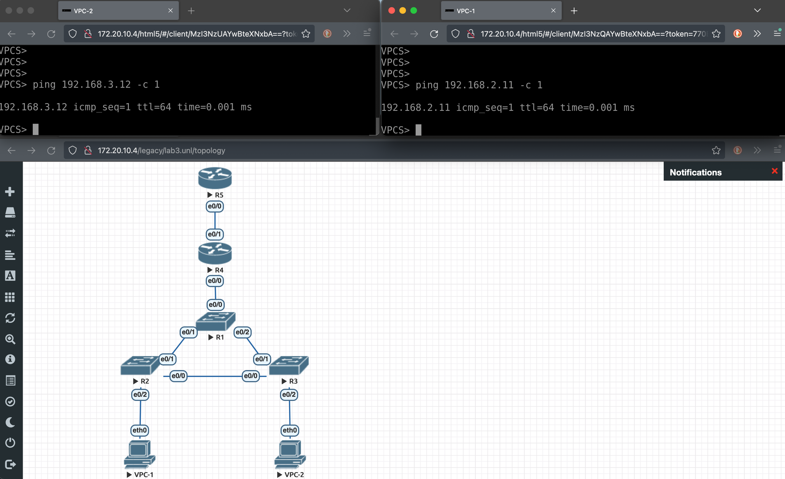

#### Проходит пинг от каждого клиента до маршрутизатора R5
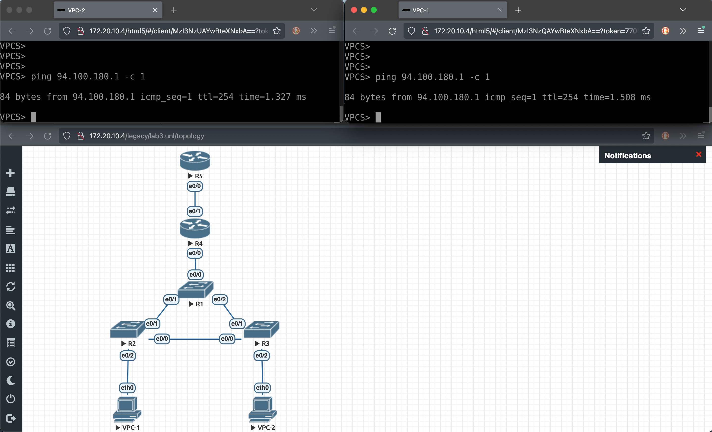

#### Клиентам по средствам DHCP выдаётся IP адрес, маска сети, dns сервер и default gateway
DNS в данном случае является DNG google.
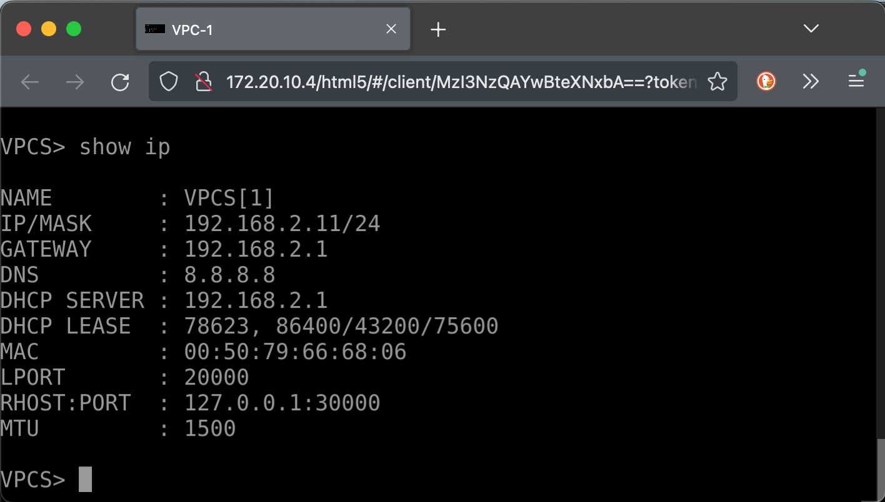
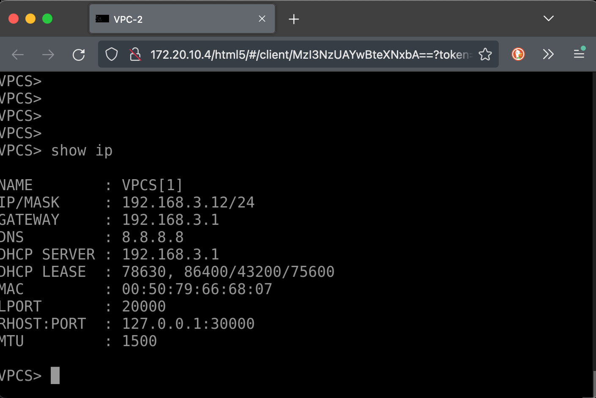

#### Биндинги DHCP
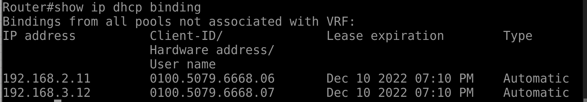

#### Трансляция ip адресов с помощью NAT
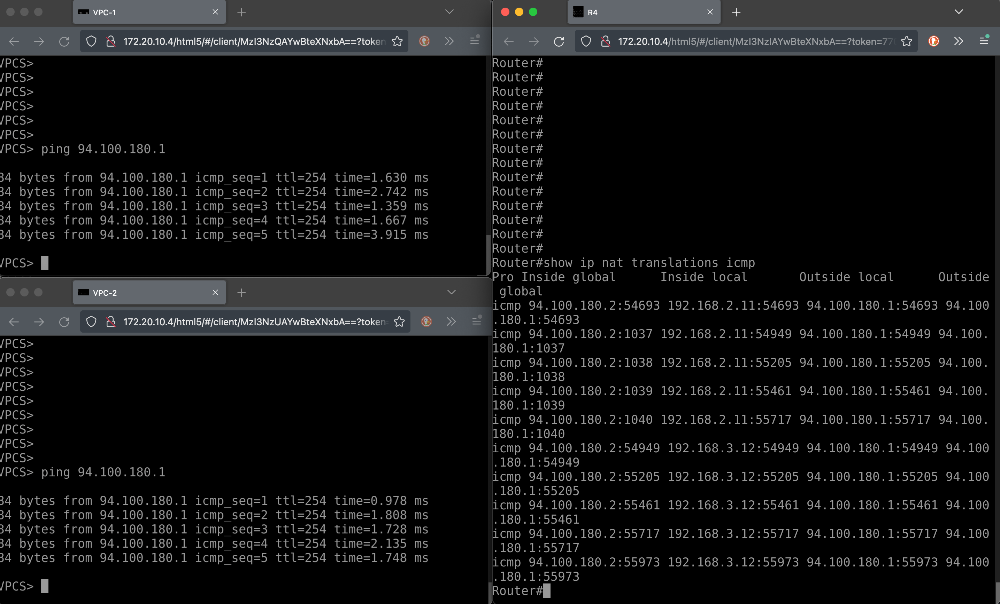

#### Трансляция порта
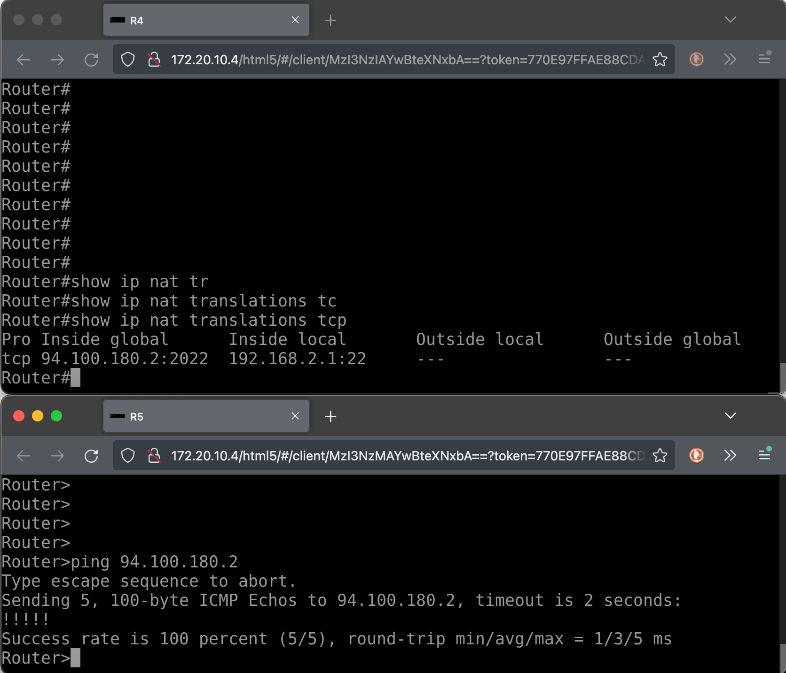

#### Настройка портов на роутерах
Маршрутизатор R4:
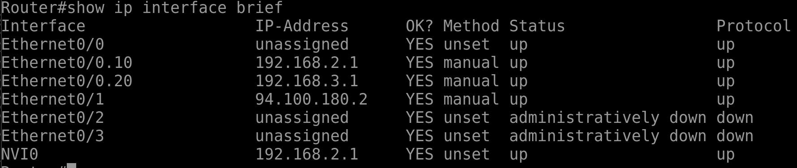
Маршрутизатор R5:
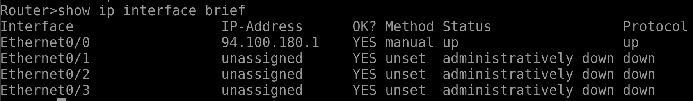

#### Таблицы роутинга маршрутизаторов
Маршрутизатор R4:
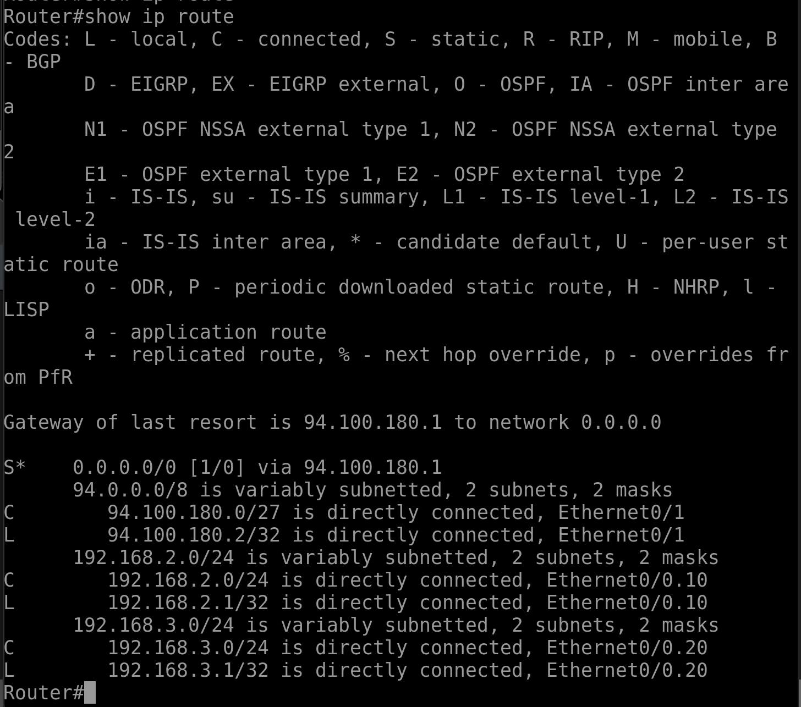
Маршрутизатор R5 (нет маршрутов в локальной сети клиентов):
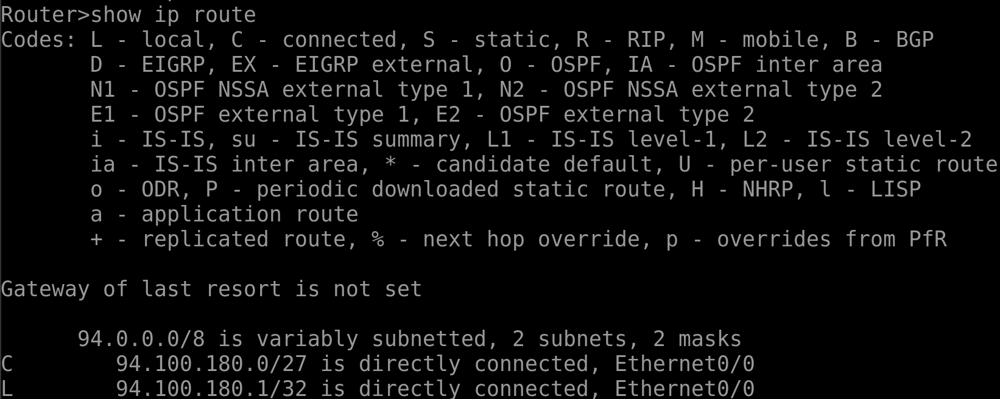
