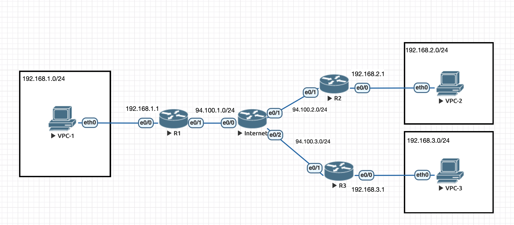
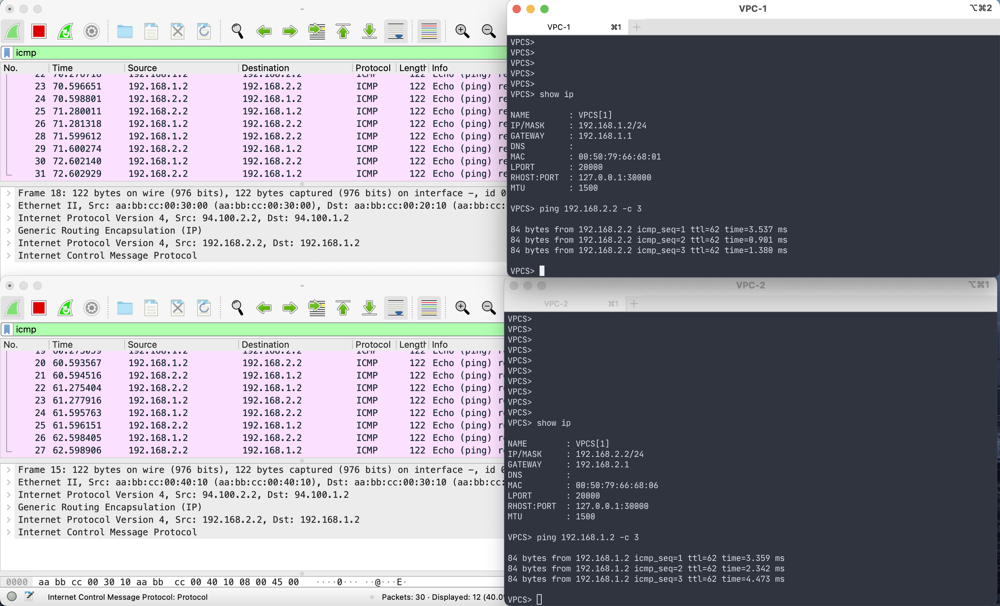
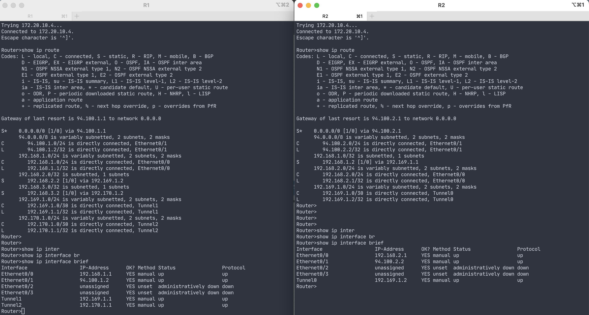
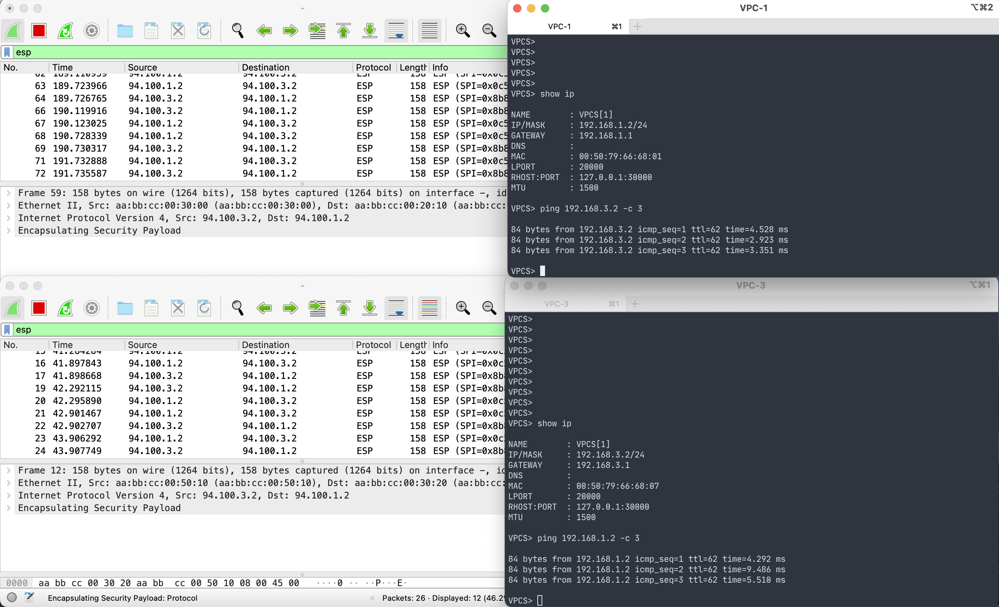
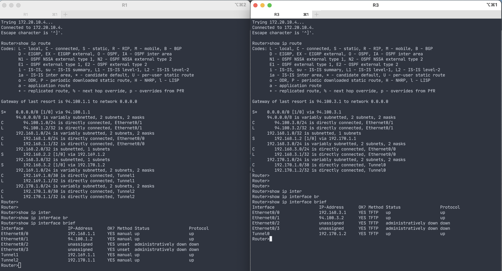
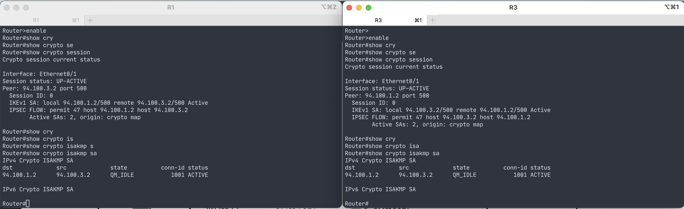
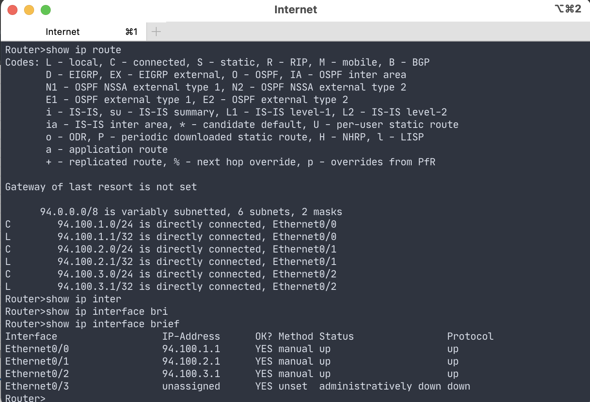

## Лабораторная работа 4
Сеть имеет следующую топологию:

#### Трафик между VPC-1 и VPC-2 проходит через GRE тоннель

На маршрутизаторах R1 и R2 созданы тоннели (Tunnel1 и Tunnel0, соответственно), а также добавлены маршруты (из локальной сети в тоннельную по другую сторону тоннеля) для прокидывания трафика непосредственно на хосты клиентов:

#### Трафик между VPC-1 и VPC-3 проходит через GRE тоннель поверх IPSEC с шифрованием

На маршрутизаторах R1 и R3 созданы тоннели (Tunnel 2 и Tunnel0, соответсвенно), и добавлены маршруты для прокидывания трафика непосредственно на хосты клиентов. Также на внешних (смотрящих в интернет) портах настроен IPSEC с политикой шифрования через протокол 3des и хэширования с помощью md5. На каждом из интерфейсов используется крипто-карта с установленными пирами (соответсвующими внешними интерфейсами) и ACL, который позволяет шифровать трафик конкретно между этими клиентами:

#### Маршрутизатор, эмулирующий интернет, знает только о directly connected сетях

